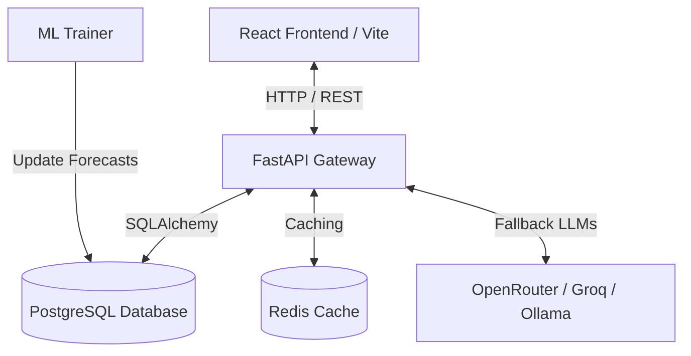

# EnerVision AI: Enterprise Energy Transition Forecasting & Simulation Platform

**EnerVision AI** is an advanced, enterprise-grade decision-support platform designed to help grid operators, policymakers, financial analysts, and researchers model, forecast, and simulate the global energy transition. 

By combining 30+ years of historical grid data with a dynamic validation-error-weighted machine learning ensemble, the platform projects electricity demand, CO₂ emissions, and renewable energy shares up to the year **2045**. Additionally, it provides a sandbox environment for real-time policy simulation, unsupervised country clustering, and a multi-agent AI Copilot with automated PDF report generation.

---

## Table of Contents
1. [The Problem Statements](#the-problem-statements)
2. [What Our Product Does](#what-our-product-does)
3. [What One Can Understand & Learn From This](#what-one-can-understand--learn-from-this)
4. [Who This is Useful For (Target Audience)](#who-this-is-useful-for-target-audience)
5. [Platform Features Explained](#platform-features-explained)
6. [Architecture & Tech Stack](#architecture--tech-stack)
7. [Data Pipeline & Preprocessing](#data-pipeline--preprocessing)
8. [Machine Learning & Dynamic Ensemble Pipeline](#machine-learning--dynamic-ensemble-pipeline)
9. [Dockerized Local Setup & Usage](#dockerized-local-setup--usage)
10. [Running ML Training & Seeding](#running-ml-training--seeding)
11. [API Gateway Documentation](#api-gateway-documentation)

---

## The Problem Statements

Decarbonizing global electricity grids is one of the most critical challenges of our time. However, grid planners, researchers, and energy ministries face several major obstacles when trying to model future pathways:

### 1. Complex Non-linear Dynamics
Energy systems are not linear. Factors like electric vehicle (EV) adoption, economic growth (GDP), and population shifts interact in highly complex, non-linear ways. Simple statistical tools fail to capture these tipping points.

### 2. The "Straight-Line" Forecasting Artifact
Traditional forecasting models often output flat or perfectly straight projection lines. 
- **Linear models** extrapolate forever in a straight line, which ignores physical capacity caps or market saturation curves.
- **Tree-based machine learning models (like XGBoost)** cannot extrapolate trends outside their training bounds, leading to artificial flatlines over long horizons.
- **Pure deep learning models (like LSTMs)** are highly expressive but can behave erratically or produce unstable trends without structural baselines.

### 3. Static Reports vs. Interactive Simulators
Most energy transition models are published as static PDFs (e.g., from the IEA or EIA). If a policymaker wants to test the impact of a specific policy shift—such as doubling wind capacity, implementing carbon taxes, or accelerating EV sales—they cannot run these scenarios in real-time.

### 4. Categorization Ambiguity & Bias
Countries are often clustered based on arbitrary geographic regions or general economic status, which hides their actual power grid characteristics (e.g., comparing a high-income fossil exporter like Saudi Arabia to a low-carbon grid like France).

---

## What Our Product Does

**EnerVision AI** bridges these gaps by providing an interactive, full-stack, AI-driven sandbox and intelligence portal:

* **Ingests & Normalizes Global Data**: Automatically aggregates historical grid metrics (solar, wind, hydro, nuclear, coal, gas, emissions, EV sales, GDP, population) for over 180 countries since 1990.
* **Computes Validation-Weighted Forecasts**: Trains four separate models (Linear Regression, XGBoost, PyTorch LSTM, Prophet) per country and metric, and builds a **dynamic validation-weighted ensemble** that combines trend extrapolation with organic growth curves.
* **Simulates Policy Adjustments on the Fly**: Allows users to apply policy shocks (e.g. accelerating fossil decommissioning, scaling renewables, mandating EVs) and recalculates the resulting demand and emissions curves instantly in the UI.
* **Groups Grids Unsupervised**: Clusters countries based on real grid characteristics (renewable shares, fossil dependence, emissions intensity) to find true peer grid systems.
* **Provides Conversational RAG Analytics**: Houses a Multi-Agent AI Copilot powered by LLMs (using Groq, OpenRouter, or local Ollama) that runs live queries against the database to answer analyst questions and compile PDF reports instantly.

---

## What One Can Understand & Learn From This

By interacting with EnerVision AI, users can derive critical grid insights:

* **Emissions Peaks & Tipping Points**: Identify when a country's carbon emissions are projected to peak under baseline growth, and how much a policy intervention can accelerate that peak.
* **Electricity Demand Surges**: Understand how rapid economic growth (GDP per capita) and EV mandates will strain grid capacity (e.g., seeing India's demand climb towards 2,600+ TWh by 2045).
* **Grid Decarbonization Feasibility**: Benchmark whether a country's current trajectory can meet its climate pledges (e.g., Net Zero target timelines) and identify the specific gap in renewable share.
* **Policy Sensitivity**: Quantify the impact of specific actions—for example, how much a **2x increase in solar/wind capacity** decreases annual CO₂ emissions while meeting increased demand.
* **Peer Grid Comparisons**: Group similar grid profiles (e.g., identifying expanding grids with high growth rates like India, China, and Vietnam) to learn from structural transitions.

---

## Who This is Useful For (Target Audience)

The platform is designed to serve a diverse group of professional users:

* **Grid Operators & Transmission System Operators (TSOs)**:
  - *Utility*: Plan generation capacity additions, grid reinforcement schedules, and evaluate baseline demand curves.
* **Policymakers & Energy Ministries**:
  - *Utility*: Formulate and stress-test national energy policies (carbon taxes, EV subsidies, coal bans) with quantitative, model-driven feedback.
* **ESG Investors & Project Finance Developers**:
  - *Utility*: Assess country-level transition readiness scores and energy supply risks before allocating capital to infrastructure projects.
* **Energy Researchers & Academic Analysts**:
  - *Utility*: Benchmark forecasting methodologies, run scenario models, and extract high-quality historical grid datasets.
* **Corporate Sustainability (CSR) Directors**:
  - *Utility*: Analyze scope 2 emissions projections of grids where their supply chain factories are located.

---

## Platform Features Explained

Here is what info you get from each tab in the platform:

```
├── Introduction Overview (Visual summary of global grid indicators)
├── Energy Forecasts      (Time-series forecast curves with 95% confidence bands)
├── Scenario Simulator    (Interactive policy sandbox with real-time feedback)
├── Regional Clustering   (Unsupervised grid system profiles & overrides)
├── Risk Assessment       (Transition readiness vs. energy supply risk indices)
└── AI Copilot            (Agentic RAG chat, SQL execution, & PDF generator)
```

### 1. Introduction & Overview
* **What you see**: High-level dashboard showing global carbon emissions trends, renewable share distributions, and key energy matrices.
* **Info you get**: A macro view of the world's energy mix, highlighting which energy sources (solar, wind, nuclear, coal, gas) dominate global production.

### 2. Energy Forecast Dashboard
* **What you see**: Historical charts transitioning into future projections (up to 2045) for Electricity Demand (TWh), CO₂ Emissions (Mt), and Renewable Share (%). Includes a toggle to switch between individual models (`XGBoost`, `LSTM`, `Linear Regression`, `Prophet`, `Ensemble`).
* **Info you get**: The primary baseline expectations. The **95% Confidence Interval shaded band** centered around the green ensemble forecast represents the margin of uncertainty, letting you know the high-case and low-case limits.

### 3. Scenario Simulator (Sandbox)
* **What you see**: Sliders for **Fossil Phase-out Speed**, **Renewable Capacity Target**, and **EV Mandate Acceleration**. When adjusted, the chart overlays a custom dashed **"Simulated Route"** directly on top of the solid baseline forecast.
* **Info you get**: Quantitative response to policy shocks. You see exactly how many Megatonnes of CO₂ are avoided, or how many additional Terawatt-hours of electricity generation will be required to support a 100% EV mandate.

### 4. Regional Clustering
* **What you see**: A 2D/3D scatter plot dividing countries into grid-system groups based on fossil fuel share, renewable capacity, and wealth.
* **Info you get**: Unbiased categorization of power grids. You get clear profiles:
  - **Fossil-Intensive (Group 0)**: High emissions, fossil-dominated baseload (e.g., USA, Australia, Poland).
  - **Expanding & Transitioning (Group 1)**: High demand growth, scaling capacity (e.g., India, China, Vietnam).
  - **Low-Carbon & Renewable-Driven (Group 2)**: Grids dominated by hydro, solar, wind, or nuclear (e.g., France, Germany, UK, Norway).

### 5. Risk Assessment Index
* **What you see**: A heat matrix scorecard rating a country's **Transition Readiness** (carbon intensity, policy pace) vs. **Supply Risk** (import dependence, grid instability).
* **Info you get**: Risk profiles for capital allocation. Higher transition readiness means lower policy risk for green projects; higher supply risk indicates a grid vulnerable to blackouts or import shocks.

### 6. AI Copilot (Multi-Agent RAG)
* **What you see**: A chat interface where you can ask questions like *"What will India's demand look like in 2040?"* or *"Compare Poland's risk to Sweden's."* You also see a trace of the agents' internal thoughts (Data Analyst Agent running SQL queries, Policy Adviser drafting suggestions).
* **Info you get**: Conversational insights backed by real data. Clicking **"Generate PDF Report"** downloads an executive brief containing historical trends, forecast metrics, simulated policy outcomes, and risk scoring.

---

## Architecture & Tech Stack

The application is fully containerized using Docker and follows a decoupled client-server architecture:



### Frontend (`/frontend`)
- **React 19** & **TypeScript** managed via **Vite**.
- **Tailwind CSS**: Sleek glassmorphism visual system, custom slate-to-slate radial gradients, and cyan-ambient logo.
- **Recharts**: Responsive charting for time-series forecast lines, confidence intervals, clustering scatter plots, and simulated sandbox lines.
- **Lucide React**: Premium icon set.

### Backend (`/backend`)
- **FastAPI**: Asynchronous high-performance API Gateway.
- **SQLAlchemy (ORM)**: Seamless database migrations and queries.
- **PostgreSQL**: Stores country-level demographics, historical energy metrics, and predicted time-series forecast records.
- **Redis**: Fast caching for analytical queries.
- **ReportLab**: Server-side engine for compiling and downloading customized PDF policy briefs.

### ML Stack
- **PyTorch (v2.2 CPU)**: Deep learning framework for Multi-layer LSTM model training.
- **XGBoost (v2.0)**: Gradient boosted tree modeling for feature interaction.
- **Prophet (v1.1)**: Additive regression model for piecewise trend shifts.
- **Scikit-Learn**: Validation metric evaluation, preprocessors, and Linear Regression baselines.

---

## Data Pipeline & Preprocessing

The ingestion pipeline (`backend/app/services/etl_service.py`) processes historical energy data dating back to **1990**.

### 1. Extracted Metrics
- **Demographics**: GDP (USD), Population.
- **Generation Mix (TWh)**: Solar, Wind, Hydro, Coal, Gas, Nuclear, and Total Generation.
- **Decarbonization Indicators**: CO₂ Emissions (Million Tonnes), EV Sales Share (%), and Renewable Share (%).

### 2. Feature Engineering
Before feeding records into the ML models, the pipeline calculates:
- **Lags**: $t-1$, $t-2$, $t-3$, and $t-5$ year steps for historical autocorrelation.
- **Running Averages**: Moving averages to smooth out meteorological anomalies (e.g., dry hydro years).
- **First-Order Derivatives**: Rate of change for emissions intensity and demand growth.

### 3. Modern Transition Filter (2005+)
To prevent historical data (such as the coal-heavy 1990s or old hydropower-dominated trends) from distorting modern energy transitions (like solar/wind scaling), the pipeline engineers lags across the entire dataset but **filters model fitting to years $\ge 2005$**.

---

## Machine Learning & Dynamic Ensemble Pipeline

Instead of choosing one single model, EnerVision AI trains **four distinct models** for every country and every metric:

| Model | Purpose / Strength | Trajectory Style |
| :--- | :--- | :--- |
| **Linear Regression** | Long-term growth trends & demographic scaling | Straight Line (Linear Extrapolation) |
| **XGBoost** | Captures multi-variable interactions | Piecewise Step (Stabilizing) |
| **PyTorch LSTM** | Captures multi-step temporal sequence dependencies | Smooth curves |
| **Prophet** | Captures piecewise capacity growth adjustments | Piecewise Curves |

### 1. Dynamic Inverse-Error Validation Weighting
The platform automatically computes the Validation Mean Absolute Percentage Error (MAPE) during validation training. The **Ensemble Forecast** is then calculated by dynamically weighting each active model's predictions:

$$W_i = \frac{1/\text{MAPE}_i}{\sum_j (1/\text{MAPE}_j)}$$

If a model fails validation checks or goes out of range, its weight is automatically redistributed. Highly accurate, curved models (like LSTM or Prophet) are given higher weights, resulting in organic, continuous curves instead of straight lines.

### 2. Symmetrical 95% Confidence Intervals
Uncertainty bounds are centered directly around the dynamic ensemble forecast line, adjusting based on historical model variance. This ensures that the upper and lower bands remain centered, proportional, and realistically scaled.

---

## Dockerized Local Setup & Usage

### 1. Prerequisites
- **Docker** and **Docker Compose** installed.
- (Optional) API Keys for the AI Copilot: `OPENROUTER_API_KEY`, `GROQ_API_KEY`, or `GEMINI_API_KEY`.

### 2. Clone and Launch
Clone the repository:
```bash
git clone https://github.com/Prasanna07-exe/EnerVision-AI.git
cd EnerVision-AI
```

Create a `.env` file in the root directory (or let Docker inherit variables):
```env
OPENROUTER_API_KEY=your_key_here
GROQ_API_KEY=your_key_here
GEMINI_API_KEY=your_key_here
```

Spin up the container stack:
```bash
docker-compose up --build
```
This builds and starts the following services:
* **Frontend**: Accessible at [http://localhost:3000](http://localhost:3000)
* **Backend**: Accessible at [http://localhost:8000](http://localhost:8000)
* **PostgreSQL Database**: Port `5432`
* **Redis Cache**: Port `6379`

---

## Running ML Training & Seeding

The database tables are automatically initialized on startup. However, you must ingest the metrics and run the ML modeling scripts to populate the forecasts.

### Step 1: Run Ingestion ETL
Ingest historical datasets:
```bash
docker exec -it enervision_backend python -m app.run_etl_cli
```

### Step 2: Train Forecasting Models
Train individual models (Linear Regression, XGBoost, Prophet, LSTM) and build the validation-weighted ensemble:
```bash
docker exec -it enervision_backend python -m app.ml.train
```
*Note: The training process takes approximately 30–40 minutes to run through all global countries.*

### Step 3: Verify the Database
Ensure forecasts are loaded correctly:
```bash
docker exec -it enervision_backend python -m app.inspect_db
```

---

## API Gateway Documentation

Once the backend is running, the interactive Swagger API documentation is available at:
👉 **[http://localhost:8000/docs](http://localhost:8000/docs)**

### Key Endpoint References:
- `GET /api/v1/countries`: Returns a list of all supported countries and codes.
- `GET /api/v1/dashboard/metrics/{country_code}`: Fetches historical metrics.
- `GET /api/v1/forecast/results/{country_code}`: Fetches time-series prediction results (all models).
- `POST /api/v1/simulate/run`: Calculates the physical impact of policy adjustments on demand and emissions.
- `POST /api/v1/copilot/chat`: Communicates with the multi-agent AI assistant.
- `GET /api/v1/copilot/download-pdf/{country_code}`: Generates and downloads a custom energy transition report.
