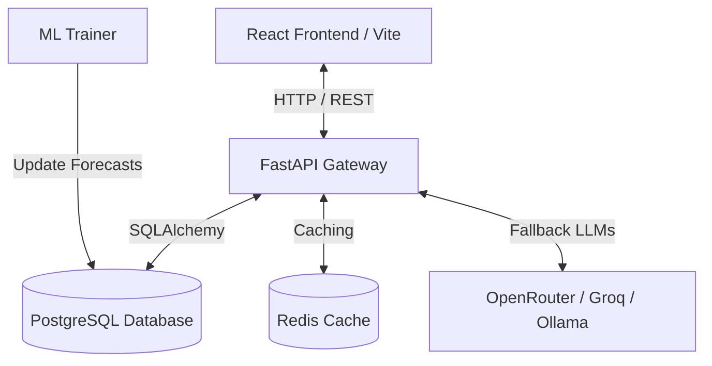

# EnerVision AI: Enterprise Energy Transition Forecasting & Simulation Platform

**EnerVision AI** is an advanced enterprise-grade forecasting, scenario simulation, and AI-assisted decision-support platform designed to help grid operators, policymakers, and energy analysts navigate the complexity of the global energy transition. 

By combining historical grid data with state-of-the-art machine learning models, the platform predicts electricity demand, CO₂ emissions, and renewable energy shares up to the year **2045**, while offering sandbox simulations for policy modeling.

---

## Table of Contents
1. [Why EnerVision AI?](#why-enervision-ai)
2. [Platform Architecture & Tech Stack](#platform-architecture--tech-stack)
3. [Data Ingestion (ETL) & Preprocessing](#data-ingestion-etl--preprocessing)
4. [Machine Learning & Dynamic Forecasting Pipeline](#machine-learning--dynamic-forecasting-pipeline)
5. [Key Features](#key-features)
6. [Dockerized Local Setup & Usage](#dockerized-local-setup--usage)
7. [Running ML Training & Seeding](#running-ml-training--seeding)
8. [API Gateway Documentation](#api-gateway-documentation)

---

## Why EnerVision AI?

Decarbonizing global energy grids requires rigorous forecasting of electricity demand, CO₂ emissions, and renewable generation capacity. Standard forecasting methods often suffer from:
- **Straight-Line Artifacts**: Traditional linear models fail to capture non-linear, exponential expansion curves of solar, wind, and electric vehicle (EV) adoption.
- **Extrapolation Limits**: Complex machine learning models (like tree-based models) struggle to extrapolate trends outside their training bounds, leading to plateaus.
- **Policy Disconnect**: Analysts cannot easily test "what-if" scenarios (e.g., carbon taxes, accelerated EV mandates, or fossil-fuel phase-out policies).

**EnerVision AI** resolves these issues by implementing a **Dynamic Validation-Weighted Ensemble** of statistical, machine learning, and deep learning models. This guarantees mathematically sound trend extrapolation (from linear components) combined with organic growth curves (from LSTM and Prophet).

---

## Platform Architecture & Tech Stack

The application is fully containerized using Docker and follows a decoupled client-server architecture:



### Frontend (`/frontend`)
- **React 19** & **TypeScript** managed via **Vite**.
- **Tailwind CSS**: Sleek glassmorphism visual system, custom slate-to-slate radial gradients, and cyan-ambient logo.
- **Recharts**: Responsive charting for time-series forecast lines, confidence intervals, clustering scatter plots, and simulated sandbox lines.
- **Lucide React**: Premium icon set.

### Backend (`/backend`)
- **FastAPI**: Asynchronous high-performance API Gateway.
- **SQLAlchemy (ORM)**: Seamless database migrations and queries.
- **PostgreSQL**: Stores country-level demographics, historical energy metrics, and predicted time-series forecast records.
- **Redis**: Fast caching for analytical queries.
- **ReportLab**: Server-side engine for compiling and downloading customized PDF policy briefs.

### ML Stack
- **PyTorch (v2.2 CPU)**: Deep learning framework for Multi-layer LSTM model training.
- **XGBoost (v2.0)**: Gradient boosted tree modeling for feature interaction.
- **Prophet (v1.1)**: Additive regression model for piecewise trend shifts.
- **Scikit-Learn**: Validation metric evaluation, preprocessors, and Linear Regression baselines.

---

## Data Ingestion (ETL) & Preprocessing

The ingestion pipeline (`backend/app/services/etl_service.py`) processes historical energy data dating back to **1990**.

### 1. Extracted Metrics
- **Demographics**: GDP (USD), Population.
- **Generation Mix (TWh)**: Solar, Wind, Hydro, Coal, Gas, Nuclear, and Total Generation.
- **Decarbonization Indicators**: CO₂ Emissions (Million Tonnes), EV Sales Share (%), and Renewable Share (%).

### 2. Feature Engineering
Before feeding records into the ML models, the pipeline calculates:
- **Lags**: $t-1$, $t-2$, $t-3$, and $t-5$ year steps for historical autocorrelation.
- **Running Averages**: Moving averages to smooth out meteorological anomalies (e.g., dry hydro years).
- **First-Order Derivatives**: Rate of change for emissions intensity and demand growth.

### 3. Modern Transition Filter (2005+)
To prevent historical data (such as the coal-heavy 1990s or old hydropower-dominated trends) from distorting modern energy transitions (like solar/wind scaling), the pipeline engineers lags across the entire dataset but **filters model fitting to years $\ge 2005$**.

---

## Machine Learning & Dynamic Forecasting Pipeline

Instead of choosing one single model, EnerVision AI trains **four distinct models** for every country and every metric:

| Model | Purpose / Strength | Trajectory Style |
| :--- | :--- | :--- |
| **Linear Regression** | Long-term growth trends & demographic scaling | Straight Line (Linear Extrapolation) |
| **XGBoost** | Captures multi-variable interactions | Piecewise Step (Stabilizing) |
| **PyTorch LSTM** | Captures multi-step temporal sequence dependencies | Smooth curves |
| **Prophet** | Captures piecewise capacity growth adjustments | Piecewise Curves |

### 1. Dynamic Inverse-Error Validation Weighting
The platform automatically computes the Validation Mean Absolute Percentage Error (MAPE) during validation training. The **Ensemble Forecast** is then calculated by dynamically weighting each active model's predictions:

$$W_i = \frac{1/\text{MAPE}_i}{\sum_j (1/\text{MAPE}_j)}$$

If a model fails validation checks or goes out of range, its weight is automatically redistributed. Highly accurate, curved models (like LSTM or Prophet) are given higher weights, resulting in organic, continuous curves instead of straight lines.

### 2. Symmetrical 95% Confidence Intervals
Uncertainty bounds are centered directly around the dynamic ensemble forecast line, adjusting based on historical model variance. This ensures that the upper and lower bands remain centered, proportional, and realistically scaled.

---

## Key Features

### 📊 Energy Forecast Dashboard
- Visualizes historical trajectories (1990–2024) and model predictions (2025–2045).
- Displays the 95% confidence interval shaded band centered around the ensemble projection.
- Supports dropdown country selection and toggles between individual models (`XGBoost`, `LSTM`, `Linear Regression`, `Prophet`, `Ensemble`).

### 🎛️ Scenario Simulator
- Enables users to toggle policy sliders:
  - **Fossil Phase-Out**: Simulated rate of decommissioning coal/gas power plants.
  - **Renewable Capacity Target**: Expected solar and wind installation multipliers.
  - **EV Mandates**: Accelerated electric vehicle adoption rates.
- Generates dynamic, real-time charts overlaying the **simulated trajectory** against the **baseline forecast**.

### 🧩 Regional Clustering
- Employs unsupervised classification logic to group global power grids into three distinct profiles:
  - **Group 0: Fossil-Intensive Grid Systems**: Grids where coal, natural gas, or oil remain the dominant sources of generation (e.g., USA, Australia, Saudi Arabia).
  - **Group 1: Expanding & Transitioning Energy Systems**: Grids experiencing rapid demand growth and infrastructure expansion, with increasing investment in renewables (e.g., India, China, Vietnam).
  - **Group 2: Low-Carbon & Renewable-Driven Grid Systems**: Grids characterized by high shares of low-carbon generation—including hydro, wind, solar, geothermal, and nuclear (e.g., Germany, France, UK, Norway).
- Includes deterministic overrides for transition leaders with specific grid structures (e.g., France, UK, and Belgium are categorized into Group 2).

### 🤖 AI Copilot (Multi-Agent RAG)
- Interactive chatbot with specialized personas:
  - **Data Analyst Agent**: Performs live SQL queries to retrieve metrics, forecasts, and model accuracies.
  - **Policy Adviser Agent**: Suggests interventions based on simulated output.
- Features **OpenRouter free auto-routing** and **Groq fallbacks** to guarantee service availability even without paid API keys.
- Supports single-click **PDF Report Generation** to compile structural brief summaries for stakeholders.

---

## Dockerized Local Setup & Usage

### 1. Prerequisites
- **Docker** and **Docker Compose** installed.
- (Optional) API Keys for the AI Copilot: `OPENROUTER_API_KEY`, `GROQ_API_KEY`, or `GEMINI_API_KEY`.

### 2. Clone and Launch
Clone the repository:
```bash
git clone https://github.com/Prasanna07-exe/EnerVision-AI.git
cd EnerVision-AI
```

Create a `.env` file in the root directory (or let Docker inherit variables):
```env
OPENROUTER_API_KEY=your_key_here
GROQ_API_KEY=your_key_here
GEMINI_API_KEY=your_key_here
```

Spin up the container stack:
```bash
docker-compose up --build
```
This builds and starts the following services:
* **Frontend**: Accessible at [http://localhost:3000](http://localhost:3000)
* **Backend**: Accessible at [http://localhost:8000](http://localhost:8000)
* **PostgreSQL Database**: Port `5432`
* **Redis Cache**: Port `6379`

---

## Running ML Training & Seeding

The database tables are automatically initialized on startup. However, you must ingest the metrics and run the ML modeling scripts to populate the forecasts.

### Step 1: Run Ingestion ETL
Ingest historical datasets:
```bash
docker exec -it enervision_backend python -m app.run_etl_cli
```

### Step 2: Train Forecasting Models
Train individual models (Linear Regression, XGBoost, Prophet, LSTM) and build the validation-weighted ensemble:
```bash
docker exec -it enervision_backend python -m app.ml.train
```
*Note: The training process takes approximately 30–40 minutes to run through all global countries.*

### Step 3: Verify the Database
Ensure forecasts are loaded correctly:
```bash
docker exec -it enervision_backend python -m app.inspect_db
```

---

## API Gateway Documentation

Once the backend is running, the interactive Swagger API documentation is available at:
👉 **[http://localhost:8000/docs](http://localhost:8000/docs)**

### Key Endpoint References:
- `GET /api/v1/countries`: Returns a list of all supported countries and codes.
- `GET /api/v1/dashboard/metrics/{country_code}`: Fetches historical metrics.
- `GET /api/v1/forecast/results/{country_code}`: Fetches time-series prediction results (all models).
- `POST /api/v1/simulate/run`: Calculates the physical impact of policy adjustments on demand and emissions.
- `POST /api/v1/copilot/chat`: Communicates with the multi-agent AI assistant.
- `GET /api/v1/copilot/download-pdf/{country_code}`: Generates and downloads a custom energy transition report.
